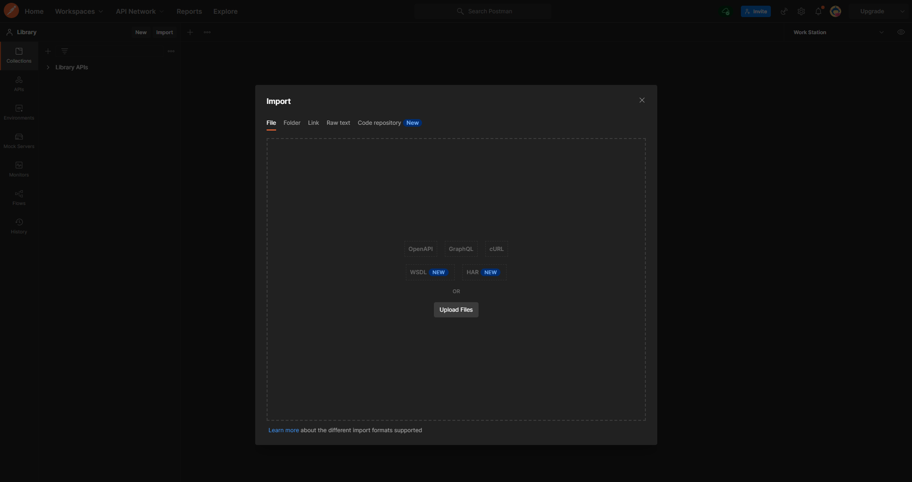

# Project Title

This is Library project. You can add your book author, and also you can create a book house.

## Requirements

| Lang       | Version |
| ---------- | ---- |
| PHP        | 8.*  |
| Laravel    | 9.*  |

## Installation

Download project to your machine.

```
git clone https://github.com/Rasimoghlu/Library.git
```

After downloading project, you have to install composer.

```
composer install
```

When you successfully completed installing composer, configure your .env file and write this command.

```
php artisan key:generate
```

If key is generated successfully, migrate all tables and factories from seed to your database.

```
php artisan migrate --seed
```
## About Project

This project has created on Laravel 9 and PHP 8.1 and for authentication used Laravel Sanctum

Here you can see created tables and their relations


Project now only on postman you can test only with API endpoints.

Exported postman configuration for this project and added dynamic variables for token and url. 
You can just take this json file

 

from app directory and import to postman and choose Work Station environment for testing API 's.



## Extra
Also added http://your-url.test/request-docs for see all routes and required parameters for api.
